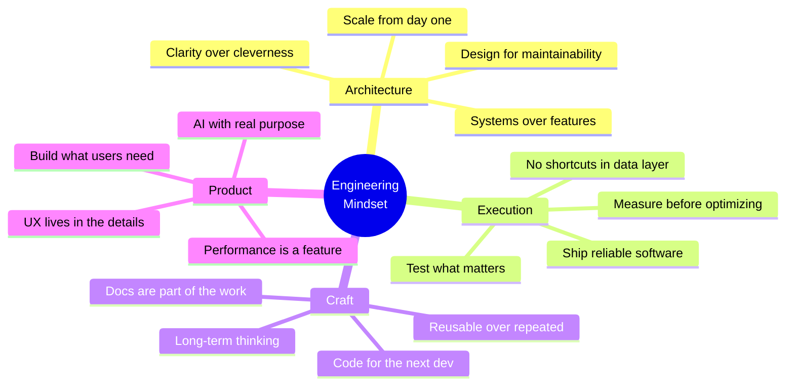

<div align="center">


</div>

<div align="center">

```
 ░██████╗░█████╗░██╗░░██╗░██████╗██╗░░██╗░█████╗░███╗░░░███╗
 ██╔════╝██╔══██╗██║░██╔╝██╔════╝██║░░██║██╔══██╗████╗░████║
 ╚█████╗░███████║█████═╝░╚█████╗░███████║███████║██╔████╔██║
 ░╚═══██╗██╔══██║██╔═██╗░░╚═══██╗██╔══██║██╔══██║██║╚██╔╝██║
 ██████╔╝██║░░██║██║░╚██╗██████╔╝██║░░██║██║░░██║██║░╚═╝░██║
 ╚═════╝░╚═╝░░╚═╝╚═╝░░╚═╝╚═════╝░╚═╝░░╚═╝╚═╝░░╚═╝╚═╝░░░░╚═╝
```

</div>

<div align="center">


</div>

<br/>

<div align="center">

[](https://linkedin.com/in/saksham-pandey21)
[](mailto:pandeysaksham21s@gmail.com)
[](https://github.com/Saksham21s)
[](https://github.com/Saksham21s)

</div>

---

<br/>

## Who I Am


I'm a **Frontend Engineer** focused on building production-grade web and mobile applications that are fast, reliable, and maintainable at scale.

My work sits at the intersection of clean architecture, developer experience, and product quality. I care about the details — from how state flows through an application to how a user perceives performance.

**What drives me:**

- Designing frontend systems that teams can grow with
- Building offline-first mobile apps that work anywhere
- Optimizing real performance, not just metrics
- Integrating AI meaningfully into product workflows

<br/><br/><br/>

---

<br/>

## Technical Stack

<div align="center">

### Core


### Ecosystem


</div>

<br/>

<div align="center">

| Layer | Technologies |
|---|---|
| **Web** | React · Next.js · TypeScript · Tailwind CSS |
| **Mobile** | React Native · Android · iOS · Expo |
| **State** | Zustand · Redux Toolkit · TanStack Query |
| **Data / Offline** | WatermelonDB · IndexedDB · LocalStorage |
| **API** | REST · Auth Flows · Token Management · Pagination |
| **AI** | OpenAI SDK · Tool Calling · Structured Outputs · LangGraph |

</div>

<br/>

---

<br/>

## What I Build

<table>
<tr>
<td width="50%" valign="top">

### Web Engineering

Building robust, scalable web applications with React and Next.js. I focus on component architecture, reusable design systems, and frontend performance that ships reliably in production.

**Specialties:**
- SaaS dashboards and admin platforms
- Internal tooling and data management systems
- Design system integration and component libraries
- Frontend performance optimization

</td>
<td width="50%" valign="top">

### Mobile Engineering

Cross-platform mobile development with React Native — from architecture to deployment. Specialized in apps that remain fast and functional even without network connectivity.

**Specialties:**
- Offline-first apps with background sync
- Complex navigation and state architecture
- Push notifications and device integrations
- Android and iOS production releases

</td>
</tr>
<tr>
<td width="50%" valign="top">

### State and Data Architecture

Designing scalable data flows that remain predictable as applications grow. I work across client state, server state, and local persistence layers — ensuring consistency across all of them.

**Specialties:**
- Zustand and Redux Toolkit for client state
- TanStack Query for server state and caching
- Optimistic updates and background synchronization
- Offline data with WatermelonDB and IndexedDB

</td>
<td width="50%" valign="top">

### AI Integrations

Building practical AI-powered features — not demos. I integrate language models into real product workflows using structured outputs, tool calling, and context-aware prompt systems.

**Experience:**
- OpenAI API with tool calling and structured outputs
- AI-assisted user workflows in production apps
- Context management for multi-turn interactions
- Exploring: LangGraph · Agent workflows · Multi-agent systems

</td>
</tr>
</table>

<br/>

---

<br/>

## Engineering Philosophy



<br/>

---

<br/>

## Currently

```yaml
status: "Active — building and shipping"

working_on:
  - Scalable React Native architecture patterns
  - Offline-first sync systems with conflict resolution
  - Reusable component systems for cross-team use
  - AI-assisted product workflows

learning:
  - LangGraph and agentic workflow design
  - Advanced system design for frontend at scale
  - Modern AI infrastructure and application patterns

open_to:
  - Frontend Engineer · React Developer · React Native Developer
  - Product Engineer · Software Engineer
  - Remote · Contract · Full-Time
```

<br/>

---

<br/>

## GitHub Analytics

<div align="center">


&nbsp;


</div>

<br/>

<div align="center">


</div>

<br/>

<div align="center">


</div>
<br/>

---

<br/>

## Let's Connect

<div align="center">

I'm always open to interesting projects, technical conversations, and new opportunities.

<br/>

[](https://linkedin.com/in/saksham-pandey21)
&nbsp;
[](mailto:pandeysaksham21s@gmail.com)
&nbsp;
[](https://github.com/Saksham21s)

<br/>

> *"Good software is built twice — first in architecture, then in code."*

<br/>

</div>

<div align="center">


</div>
