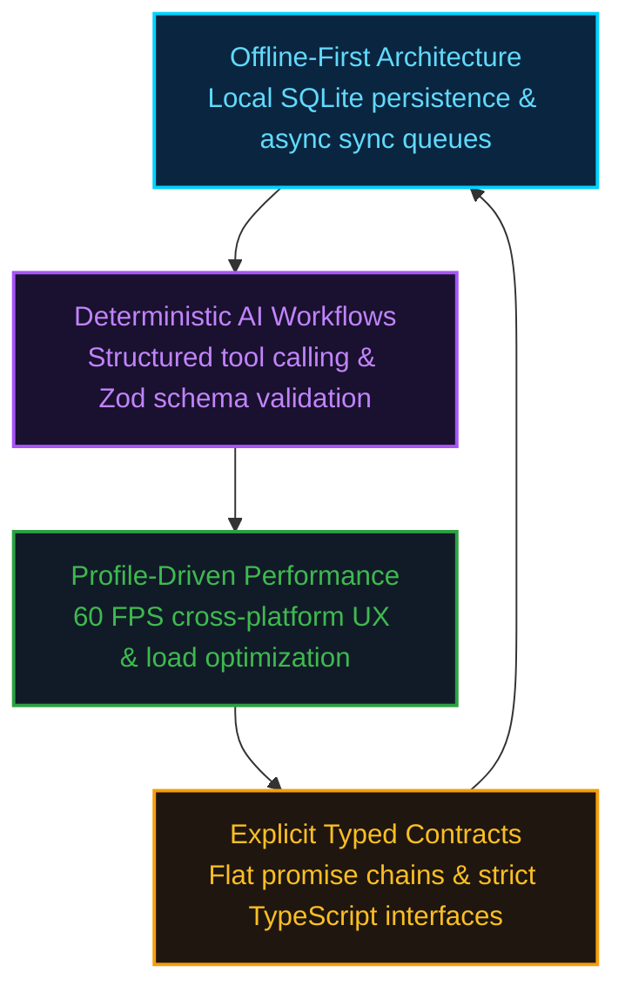

  
  
  

    

  
  
  
  

    

  
  
  

 

<table align="center" width="100%">
  <tr>
    <td align="center" width="50%">
        
      <b>Next.js & Node.js Systems</b> 
      Production web applications, App Router SSR optimization, and typed REST services.
    </td>
    <td align="center" width="50%">
        
      <b>React Native & WatermelonDB Persistence</b> 
      Relational SQLite local storage, background sync queues, and resilient client state.
    </td>
  </tr>
  <tr>
    <td align="center" width="50%">
       
        
      <b>LangGraph & OpenAI Integration</b> 
      Stateful multi-agent graphs, Zod schema validation, and structured tool calling.
    </td>
    <td align="center" width="50%">
       
        
      <b>High-Efficiency Interface Engineering</b> 
      UI thread profiling, sub-second web load times, and steady 60 FPS mobile performance.
    </td>
  </tr>
</table>

 

### About Me

Full-stack software engineer architecting **scalable web platforms**, **cross-platform mobile applications**, and **agentic AI systems**. Specialized in modern TypeScript ecosystems by combining Next.js frontends, React Native mobile clients, and Node.js backend services with local data synchronization and structured LLM tool-calling pipelines.

Focused on shipping clean, well-architected code designed for production reliability, long-term maintainability, and high-impact user experiences across global products.

 

### Technical Capabilities

<table>
  <tr>
    <td width="50%" valign="top">
      <h4>Full-Stack Web Engineering</h4>
      Production web platforms built with Next.js (App Router) and React.  
      Server-side rendering (SSR), static generation (ISR), and hydration tuning.  
      Modular design systems using Tailwind CSS and atomic UI components.  
      State management using Zustand, Redux Toolkit, and TanStack Query.
    </td>
    <td width="50%" valign="top">
      <h4>Cross-Platform Mobile Architecture</h4>
      Cross-platform iOS and Android apps using React Native and Expo.  
      Local relational persistence powered by WatermelonDB and SQLite.  
      Asynchronous background synchronization queues with conflict resolution.  
      UI thread profiling ensuring steady 60 FPS on low-cost devices.
    </td>
  </tr>
  <tr>
    <td width="50%" valign="top">
      <h4>Agentic AI & LLM Systems</h4>
      Stateful multi-agent workflows engineered with LangGraph and LangChain.  
      Deterministic LLM tool-calling loops with strict JSON schema validation.  
      Embedding vector retrieval (RAG) integrated directly into product pipelines.  
      Fallback recovery protocols for AI outputs in production environments.
    </td>
    <td width="50%" valign="top">
      <h4>API Services & Client SDKs</h4>
      RESTful microservices built with Node.js, Express, and MongoDB.  
      Typed client libraries and consumable SDKs for web and mobile.  
      Centralized error boundary layers and standardized payload formats.  
      Database indexing, query optimization, and connection pooling.
    </td>
  </tr>
</table>

 

### Systems Case Studies

<table>
  <tr>
    <td width="33%" valign="top">
        
      <b>High-Throughput Web Systems</b>
      
<b>Goal:</b> Delivering fast, accessible web applications designed for high user engagement.

      
<b>Approach:</b> Built Next.js App Router frontends with TanStack Query caching, SSR tuning, and Node.js REST services.

      
<b>Outcome:</b> Fast page load performance, predictable state management, and scalable component architecture.

    </td>
    <td width="33%" valign="top">
        
      <b>Offline-First Mobile Systems</b>
      
<b>Goal:</b> Ensuring continuous application usability regardless of mobile network stability.

      
<b>Approach:</b> Implemented local SQLite storage using WatermelonDB paired with background sync queues.

      
<b>Outcome:</b> Sub-10ms local interaction response, zero data loss on network drops, and smooth 60 FPS rendering.

    </td>
    <td width="33%" valign="top">
        
      <b>Agentic AI Automation</b>
      
<b>Goal:</b> Integrating intelligent AI tools directly into structured software workflows.

      
<b>Approach:</b> Designed LangGraph state graphs with automated tool execution and Zod schema verification.

      
<b>Outcome:</b> Reliable, multi-step AI features that operate deterministically inside product interfaces.

    </td>
  </tr>
</table>

 

### Tech Stack & Ecosystem

<table>
  <tr>
    <td width="160" valign="middle"><b>Web Frontend</b></td>
    <td>
      
    </td>
  </tr>
  <tr>
    <td valign="middle"><b>Mobile Platform</b></td>
    <td>
      
    </td>
  </tr>
  <tr>
    <td valign="middle"><b>Backend Services</b></td>
    <td>
      
    </td>
  </tr>
  <tr>
    <td valign="middle"><b>AI & Orchestration</b></td>
    <td>
      
      
      
      
    </td>
  </tr>
  <tr>
    <td valign="middle"><b>State & Data Sync</b></td>
    <td>
      
      
      
      
    </td>
  </tr>
  <tr>
    <td valign="middle"><b>Tooling & DevOps</b></td>
    <td>
      
    </td>
  </tr>
</table>

 

### Engineering Principles

```mermaid
graph TD
    classDef offline fill:#0A2540,stroke:#00D2FF,stroke-width:2px,color:#61DAFB;
    classDef ai fill:#1A102F,stroke:#A855F7,stroke-width:2px,color:#C084FC;
    classDef perf fill:#111B27,stroke:#2EA043,stroke-width:2px,color:#3FB950;
    classDef clean fill:#1F1610,stroke:#F59E0B,stroke-width:2px,color:#FBBF24;

    A["Offline-First Architecture<br/>Local SQLite persistence & async sync queues"]:::offline --> B["Deterministic AI Workflows<br/>Structured tool calling & Zod schema validation"]:::ai
    B --> C["Profile-Driven Performance<br/>60 FPS cross-platform UX & load optimization"]:::perf
    C --> D["Explicit Typed Contracts<br/>Flat promise chains & strict TypeScript interfaces"]:::clean
    D --> A
```

 

### Consolidated Analytics Dashboard

  
  
  
    
  
  

    

  

 

  

